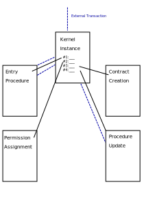

# Beaker: An open-source exokernel protocol for decentralized organizations on Ethereum.

Authors:
* Jacob Payne
* Jake O'Shannessy
* Alexey Troitsky

## Abstract

We describe a secure and extensible exokernel protocol for decentralized organizations. Using a capability-based security model, we can facilitate secure and low friction peer-to-peer state management across multiple organizations on the Ethereum blockchain. The protocol is intended to serve as an open standard and building block, establishing interoperability between decentralized organizations that provide 3rd party services and protocols.

## Introduction

> *Every program and every privileged user of the system should operate using
> the least amount of privilege necessary to complete the job.*
>
> — Jerome Saltzer, Communications of the ACM

The underlying idea of decentralized organizations is the use of blockchain technology to securely manage and track a broad range of financial interactions without requiring a trusted third party. This in turn eliminates the need for repetitive recording of financial data and business agreements between different records.

While lucrative, the development and deployment of such organizations has a high barrier of entry. Smart contract development practices and tooling are still in their prenatal stages of maturity, with zero margin for error. Communication between organizations is essential and requires the establishment of new protocols to assign contract agreements between parties. Additionally, the system must be extensible upfront to allow changes and upgrades to such protocols and still maintain high standards of safety.

Beaker is a minimal open-source exokernel protocol to establish low friction state changes within organisations. It is intended to serve as a building block for establishing secure and scalable organisations that will grow in complexity and will require long term extensibility.

Using Beaker, users can establish an organisation on the blockchain with a much higher level of confidence in it's stability and security. The safety model Beaker provides not only reduces risk, but allows organisations to be designed in a much more flexible and robust manner.

The exokernel model of Beaker allows organisations to freely define their own systems and procedures, but within a safe and controlled environment. The Beaker kernel can handle things such as resource usage, communication with other organisations, and provide the building blocks to build powerful governance models, which are crucial in these types of systems.

## Problems

Smart contracts are, by their nature, unforgiving machines that follow the their specification to the letter. This is one of the selling points of smart contracts, but it can also be their downfall as the machine will faithfully execute any flaw or mistake in that code. This is a well known property of smart contracts, and is tackled in a variety of ways. By employing lower level primitives like multi-signature wallets or escrow, the users of smart contractscan build a more flexible and forgiving system on top of the raw  and unforgiving Ethereum machine underneath.

Building higher level systems such as wallets and escrow are a double-edged swords however, by providing protection against the ruthlessness of the machine, they also increase the complexity of the system one is using. This forces users of smart contracts to strike a balance between contracts that are simple but inflexible or flexible but complex. With this complexity comes the risk that one small error or vulnerability can bring down a whole system. In order to prevent this we want some form of security and control.

## Existing Work

The design and development of decentralized organizations implemented within Ethereum have so far failed to be standardized. Due to the generally highly specialized nature of these systems, most service platforms and protocols developed have been fragmented in their common design specifications. Both the service protocol and organization model itself were tightly interdependent.

The lack of a standard model for organizations has so far lead to many security vulnerabilities. One of the prominent examples was “The DAO” that was built to act as a hedge fund with a built-in proposal protocol to manage funds. The implementation was written in a highly specialized manner and did not separate protection from logic. This lead to a large attack space and ultimately a re-entrancy vulnerability that allowed the attacker to steal funds from the organization itself.

While implementations of different organization models are many, they all share the common ground of protecting funds, establishing decision management, and facilitating a token through a tokenized service platform. We propose a more general approach by creating a common ground of system protection and separating service logic from security.

## Overview

In their early days, computers were simply machines that executed a
sequence of instructions and manipulated input and output devices, blindly
following the instructions laid out by the programmer. It was up to the
programmer to ensure that the program they wrote was correct. Once the computer
was executing the programmer had reliquished control and the program would
execute as written.

Driven by a need to manage multiple programs, and eventually include
restrictions, quotas and permisions, operating systems were created. With
operating systems, the programs weren't just excuted blindly by the machine.
When the machine encountered an instruction that required hardware access, it
suspended the running program and passed that instruction to the operating
system, which then decided what to do. This gave the operator of the machine
control over what was and wasn't allowed to occur on the machine, at the cost of
some run-time monitoring.

On Ethereum the situation is very similar to those early days of computers. Smart contracts are thoroughly audited and tested, but once they are on the blockchain they execute on the raw machine. If we want a system where we can interpose ourselves between our components and potentially dangerous resources (such as our storage) we need to make stronger guarantees about the safety of our system without having to apply the same level of verification to every component.

In order to do so, we need to require that all contracts interact with critical resources only through system calls. Once a contract is only operating through system calls, the operating system kernel has the final say on what the contract can or cannot do.

### Procedures

A _procedure_ is a smart contract owned by the kernel. Ownership in this case, means that only the kernel can destroy the contract. Unlike normal smart contracts, procedures have several restrictions in the form of system calls that do not allow them to directly access storage, make outside calls or send transactions.

Much like processes are stored in a process table within a traditional operating system, procedures are stored within a _procedure table_. Each entry contains the id, capability list and address. Unlike a process table however, the procedure table does not maintain procedure state across separate transaction calls.

### On-Chain Code Verification

In order to verify that a procedure follows certain restrictions we use _On-Chain Code Verification_, or OCCV for short. OCCV is the use of a trusted smart contract to read and verify the code of an untrusted smart contract. By reading an untrusted contract before creation (`CREATE` opcode) or after creation (`EXTCODECOPY` opcode), we can now make assertions what it can and cannot do.

With OCCV we can check if an untrusted contract has any opcodes that we might not allow. While this can be limited, this allows us to check if a contract can potentially: self destruct, make state changes, emit events, or make an external call. This might not seem much, but the absence of such code allows us to make certain guarantees: If the code does not contain the combination of selfdestruct, delegatecall or callcode, we now know that this code will never be able to be destroyed.

In our case, the trusted contract will be our kernel, while the untrusted contract would be a procedure. Before running a procedure, the kernel can check and verify the procedure, allowing the kernel to enforce certain restrictions or access control. The kernel only needs to do this check only once however, since in Ethereum the code of a contract can never change.

### System Calls

As we covered above, a traditional operating system achieves introspection and
control by interposing itself between the processes that are running and all
other parts of the system including storage, memory, and even other processes.
Each process is given its own memory and access to a processor, but is otherwise
completely isolated. In order to do even the most fundamental thing (be in print
a character to the screen or read some stored data) it must ask the operating
system to do it on its behalf. It is only through the operating system that the
process can affect the real world. Via this mechanism, we (as the owners of the
operating system) have complete control over what that process can do.

These requests to the operating system that a process makes are called system
calls.

The sequence of EVM opcodes below define a beaker system call. The input and output parameters of the system call are set prior to these instructions, and are the responsibility of the designer of the contract (presumably with significant assistance from libraries).

```
CALLER
DUP
EQ
NOT
PUSH erraddr
JUMPI
DELEGATECALL
```

These instructions ensure that the contract is only calling to the original kernel instance and nothing more. Because this sequence of instructions is the only sequence of instructions with a state changing opcode (`DELEGATECALL`) we can use On-chain code verification to prove that a contract contains no state changing opcodes and that when it does so in form of a system call.

This delegate call is a call back into the kernel. The kernel will only accept system calls from procedures in its procedure table that it is currently calling. When a procedure is initially called, it is called via `CALLCODE`. This means that that our system, which we will call our "kernel instance", is the current storage and event space of the running code. It also means that the `CALLER` value, which is a global read-only value, is set to the address of out kernel instance. When our procedure does a `DELEGATECALL`, this address is maintained. As a consequence, whenever a kernel is executing a system call, it is able to simply check that the `CALLER` value is equal to its own address (it is necessary for this value to be hardcoded into the instance, which is performed during instantiation).

With this we have a kernel that is generally only accessible from its own procedures. It must, however, also accept some form of external transaction, this is the only way it can be triggered to execute code. As an operating system Beaker should have no say over what kind of transactions and programs a system wants to execute. Beaker follows a exokernel design, where the kernel itself should stay out of the user's code as much as possible.


1. Kernel instance executes a procedure by doing delegate call to the kernel.
2. The kernel fulfils this request by doing a delegate call to the contract.
3. While processing, the contract encounters a system call and does a
   delegate call to the `CALLER` value, which is the kernel instance.
4. The kernel instance checks that itself is the original caller and if so,
   calls the kernel library for processing.

### Entry Procedure

We have established that a Beaker kernel instance has to accept two types of transactions:

- A system call, which will come from an executing procedure that the kernel itself called earlier.
- An external transaction from an address associated with a user. This is what will trigger whatever actions the designer of the system has chosen to implement.

We have covered above how system calls are secured by only accepting system calls from the procedures owned by kernel (we will cover permissions and capabilities later), but we must also establish a procedure for external transactions.

In order to define an interface to the kernel, we have a procedure which is designated as the _entry procedure_. This entry procedure is created (and updated if need be) by the user, and is executed as a normal procedure. When the kernel instance receives an external transaction from another Ethereum address, it simply forwards the message data to the entry procedure. Thus whenever any transaction reaches the kernel, it is up to our entry procedure to decide what should happen and acts as the interface to the kernel.

While it is completely up to the user to specify how the entry procedure works, here is an example for how such a procedure might be implemented.

*Figure presents the general sequence of steps used for executing a procedure.*

> The example will be something like the following:
>
> Imagine a system that has
> many users. These users are people with Ethereum addresses that participate in
> an organtisation that is described by our system. When they choose, they are
> able to execute one of the functions of this organisation by sending a
> transaction to our system. Each of these users has different levels of
> authority, and therefore we need some way to be certain that only the users
> that we specify can execute some of the more restricted function of the
> organisation of the system.
>
> Whenever one of these transactions reaches the kernel, it is passed directly to
> user code, no questions asked. It is up to our entry procedure to decide what
> should happen. Let's say our kernel receives a message which requests that the
> "deleteMember" function be executed to delete a certain member from the
> organisation. This message will be passed on to the entry procedure, and it is
> up to the entry procedure to execute that function.

In this example, our entry procedure will check the user's address against a list of known administrators and determine if they are permitted to execute this procedure. If they are not, the entry procedure can simply reject that message and revert the transaction.

### Auditabilty and the Principle of Least Privelege

It may seem like no great gain to implement all of this additional complexity when in the end we simply pass the transaction to a user defined contract. This contract still needs to make all the same logic decisions and is subject to the same risks and issues as any Ethereum contract.

Where the operating system model improves this status quo is in isolation. Just as when running Linux it would be possible to run everything as root, so too in Beaker would it be possible to run everything in the entry procedure and have little to no benefit. What this has allowed us to do is to isolate the highest risk portion of our code to this entry procedure, which ideally should be kept as small and as robust as possible.

As everywhere in computing, the princple of least privelege applies here, and once the entry procedure has made a determination of the level of privelege require it should pass control to more specialised more restriced procedure that can then implement large amounts of logic without the risk of accidentally (or maliciously) executing some of the more dangerous functions of the system.

## Security Model

Above we established two critical components of the Beaker exokernel: introspection via system calls, and using this to achieve the principle of least privilege.

When you create a process on Linux system, that process comes with restrictions (usually determined by the user it is run as). Even if the code in that process asks to do something outside of what it is permitted to do, the operating system will refuse to service that system call, and the process will therefore not be able to escape its restricted box.

These restrictions do not generally exist *within* programs. It is not possible in most programming languages to import a library or module and say to the "my program sends packets over the network, and must have permission to do so, but this section of code coming from this library should not be able to". This is the state of Ethereum security currently. Everything is built as a single program, without internal security boundaries (the new `STATICCALL` opcode is on attempt to implement this).

However, now that we have established an operating system with system calls, we now have that point of control over the contracts running on our system, and we can craft policies to allow or deny any action that interacts with the rest of the system. Beaker provides a system whereby system calls from procedures can be rejected outright based on a policy set by the owner of the system.

*Fig of Example*

_In our example above, the entry procedure could contain only a very simple block of logic which says that if the sender is one of the administrators, the received message is passed to another procedure which handles administrator actions, while all other senders are passed to another procedure which handles general members and unknown senders. This is a good example of the principle of least privilege. If there is a bug in the code that checks which administrators can delete users and under what conditions, that bug can only be triggered by administrators. All other senders are immediately siphoned off to the general member procedure. This significantly reduces the risk for both mistakes and malicious actions._

_If there is a mistake in the general member procedure, this is now less critical as the operating system will prevent it from interacting with the critical parts of the system, and so actions like deleting a user are prevented by the policies of the entry procedure._

This leaves us with a piece of code that has full power and could potentially do anything if it failed: the entry procedure. Now, however, the high risk code that has all of this power is limited to a few lines of code that simply direct different users' messages to different parts of the system. By making this piece of logic small we can verify it much more easily.

### Capability Based Security and Their Advantages

Now that we have this system which can allow or deny various system calls (thereby reducing the level of privelege and risk of different sections of code in the system), we need some way to specify the policies that provide these barriers. If we provide a policy mechanism that is too simple, it will not be able to provide the necessary guarantees. If it is too complex, then it is far less auditable and becomes almost as complex as the procedure themselves.

One driving observation is that the interactions and code of Ethereum contracts don't match the user-based permissions of a traditional operating system. Additionally, given the "hands-off" microkernel approach, we want to give as much freedom to the designer of the system as possible. For this reason our security model needs to be an abstraction that is high level and efficient.

It is also important that the system be as resistant as possible to the many mishaps that can befall permissions systems (see the confused deputies problem as an example), and be well studied in academic literature. For these reasons in particular we have chosen a capability-based security model for Beaker.

### Implementing a Capability Based Security Model

**TODO:** We need to note that our capability system is based around assigning
capabilities to procedures, which it then holds when run. This can definitely be
used to model user capabilities (users are simply routed through procedures
which hold the appropriate capabilies). It does not handle dynamic capabilities,
but the current line of thinking is that we should only include those when they
are shown to be necessary.

One of the goals that would improve security and auditability of a system is that an external party or higher level "system designer" might require control over what the various conracts in the system can do. This would allow them to compartmentalise areas of code and ensure that code only has the priveleges it requires, focusing attention on more critical high-risk code. Even if another member of the organisation updates a contract under his or her control, the system designer should be able to limit the potential damage of an error or malign action by sandboxing that contract.

This can be done by giving each procedure a set of capabilities, outside of which it cannot act. Even if the procedure is updated, unless the developer also has the right to increase its capabilities, system designers and auditors have some guarantees that it will not do something harmful to parts of the system outside its purview.

The simplest model is simply to give every procedure a list of permitted actions. Procedure creation is in two steps:

- Creation/Update: where the contract bytecode is uploaded to the kernel.
- Permission assignation: where somebody with the appropriate authorisation sets the capabilities of the procedure.



It is critical to note that the capability system proposed here does not attempt to deal at all with *"users"*. If a particular system includes users (which is to be expected) it is left to the creators of that system to dictate how that is organised and implemented. By default, Beaker routes all external transactions through a (modifiable) procedure which acts as a form of "gatekeeper". It is within this procedure that decisions about what each user can do are made.

When a procedure is created, it has zero capabilities available to it in its list. If, for example, it needs to modify the storage value at `0x7`, it will need to be provided with that permission by a separate permission assignation. In this workflow, the procedure is deployed by a developer, and the permissions are assigned by the system designer once he approves this. The workflow around how permissions are requested and designed are left to the users.

**SIDENOTE:** Perhaps we allow a procedure to be run on every syscall what does
whichever system checks the designers deem appropriate although the large number
of procedure calls make this very expensive. It is always possible to provide
system creators with such hooks.

In this situation it would be important to give the system designer powerful design tools.

**What can't this do?** Something like storage locations or procedure ids can't
be chosen dynamically, as delegation of capabilities does not occur.

Everything is statically determined by the system designer (although permissions may be changed at any point).

This design has advantages over more dynamic, flexible, capability systems, as it explains, in a very static and assessable manner:

1. Where do permissions come from?
2. How are they set?
3. How are they enforced?

### Capability Types


| Kernel Object | Capability Type | Description                                                         |
|---------------|-----------------|---------------------------------------------------------------------|
| Procedure     | Create          | Create procedure with given identifier, capabilities and root flag. |
|               | Call            | Call procedure by given id and arguments.                           |
|               | Delete          | Delete procedure by identifier.                                     |
|               | Entry           | Set the procedure with given identifier as the entry procedure.     |
| Storage       | Read            | Read from the memory by the given address.                          |
|               | Write           | Write to the memory by the given address.                           |
| Log           | Write           | Append log record with given topics.                                |
| Gas           | Received        | The total amount of gas received from user.                         |

Kernel Objects are defined by a category of related capability types that designate the resources in the kernel that can only be accessed through a system call and are protected by the kernel's reference monitor.

#### Procedure Table

The procedure table object is a dynamic list of procedure identifiers that designate what procedures the kernel has available. Each procedure is defined by a unique identifier, contract address and a capability list.

##### Create
```rust
fn proc_create(id: u32, mlist: &[MintParameters], root_flag: bool) -> Result<(), id_already_exists>;
```
Create procedure with given identifier (id), capabilities and root flag.
Capabilites are minted from the capabilities of the parent procedure with clist argument.


###### Arguments
* id - identifier of the new procedure
* mlist - array of same size as the clist of parent procedure and contains logic of minting capabilities of the parent procedure to child procedure
* root flag - boolean value whitch indicates that this procedure become the root procedure 

###### Return Value
OK

###### Errors
* id_already_exists - procedure with given id already exists

##### Call

```rust
fn proc_call<T, E>(id: u32, args: &[u256]) -> Result<T,E>;
```
Call procedure by given id and with a list 32byte arguments.

##### Arguments
* id - identifier of the procedure to call
* args - list of arguments

##### Return Value
The result of the procedure.

##### Errors
* unknown_procedure - no procedure with given id
* procedure_error - some error happened during procedure execution

#### Delete
```rust
fn proc_delete(id: u32) -> Result<(), UnknownId>;
```

Delete procedure by id.

##### Arguments
* id - identifier of the procedure

##### Return Value
OK

##### Errors
* unknown_id - procedure with given id doesn't exist

#### Root
```rust
fn proc_set_root(id: u32) -> Result<(), UnknownId>;
```
Set the procedure with given id as the root procedure.

##### Arguments
* id - procedure id

##### Return Value
OK

##### Errors
* unknown_id - procedure with given id doesn't exist

#### Storage

The Storage object is defined by a 32 byte storage location that a procedure can either read or write a 32 byte value. In order to provide the kernel a protected storage space, storage is divided into two spaces, kernel-space and user-space storage, which is designated with the last bit where kernel-storage is true (1), and userspace is false (0). This provides userspace 2^255 unique keys which should be adequate long-term.

##### Read
```rust
fn store_read(addr: u256) -> u256;
```
Read from the memory by the given address.

###### Arguments
* addr - memory address

###### Return Value
256 bits stored in the given address

##### Write
```rust
fn store_write(addr: &u256, val: &u256);
```
Write to the memory by the given address. 

###### Arguments
* addr - memory address
* value - 256 bits to store 

#### Events

The Event Object is defined directly from the `LOG{1,2,3,4}` opcodes, where a procedure event capabilitiy is defined by a 32 byte namespace for unique event propogation.

##### Write
```rust
fn event_write(topics: [&u256]) -> Result<(), illegal_topics>;
```
Append log record with given topics.
Size of the topics array determines the log opcode, and that's why it has to be less or equal to 4. 

###### Arguments
* topics - array of topics

###### Return Value
OK

###### Errors
* illegal_topics - illegal size of the topics array  

#### Gas

The Gas Object is defined as the total gas resources the kernel has available and designates how much resources are allocated to a procedure to spend during execution.

##### Received
```rust
fn gas_recieved() -> u32;
```
The total amount of gas received from user.

###### Return Value
Amount of gas.

## Applications

### Relayers

In order for organizations to interact and respond with the real world, there must be public locations where users and organizations may dispatch procedures that are subsequently aggregated and dispatched based on external event hooks. Building and operating such an event-hook system is costly and a traditional procedure call does not provide incentives for someone to take that expense. _Incentivized Procedures_ solve this issue by requiring the kernel to pay back for the procedure cost with an additional fee.

This allows anyone to act as a service provider for organizations, maintain an event-hook system (public or private) and charge transaction fees on all procedure calls. We refer to entities that host and maintain an event-hook system as _Relayers_.

A centralized system must build and operate proprietary infrastructure to facilitate and execute financial transactions. Relayers merely facilitate signaling between organizations by hosting and propagating events that consist of generic messages. Relayers do not execute procedures on behalf of organizations as this would require them to trust the Relayer. Instead, organization members execute their own procedures.

*Figure 3. Relayers host and maintain an off-chain event hook system in exchange for transaction fees. This diagram illustrates the general sequence of steps used by Users and Relayers to negotiate transaction fees in a trustless way.*

### Filesystem

*Here we can provide an example of how a filesystem that uses the capability
model can provide a storage abstraction to procedures*

## Summary

* The Beaker exokernel provides a secure environment for organizations to establish extendible business logic through restricted smart contracts defined as procedures.
* Capability-based security model allows for custom permissions and policies.